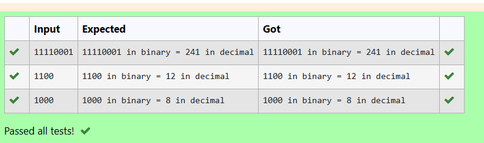
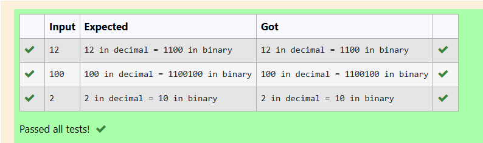

# EX3(A)Functions(2)
Developed by: ARSHITHA MS

Register number: 212223240015
 ## AIM:
 To write a program to convert binary to decimal and decimal to binary.

 ## ALGORITHM:
 1.Start the program

 2.Declare the variables

 3.Get input from the user.

 4.Use while loop for both the programs.
 
 5.Print the output.

 6.End the program

 
 ## PROGRAM
 ### Program 1(Binary to decimal):
 ```
 #include <stdio.h>
#include <math.h>
int binaryToDecimal() 
{
    long long binaryNumber,k;
    int decimalNumber = 0, i = 0, remainder;
    scanf("%lld", &binaryNumber);
    k=binaryNumber;
    while (binaryNumber != 0) {
        remainder = binaryNumber % 10;
        decimalNumber += remainder * pow(2, i);
        ++i;
        binaryNumber /= 10;
    }

    printf("%lld in binary = %d in decimal\n", k,decimalNumber);
    return 0;
}

int main() {
    binaryToDecimal();
    return 0;
}

```
### Program 2(Decimal to binary):
```
#include <stdio.h>
int binary(int n)
{
    int i=1,r,bin=0;
    while(n)
    {
        r=n%2;
        n=n/2;
        bin=bin+(r*i);
        i*=10;
    }
    return bin;
}
int main()
{
    int n,r;
    scanf("%d",&n);
    r=binary(n);
    printf("%d in decimal = %d in binary",n,r);
}
```

## OUTPUT:
### Output 1:



### Output 2:


## RESULT:
Thus the program to convert binary to decimal and decimal to binary is executed successfully.